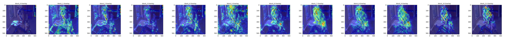

# Transformer Explainability: ViT vs DinoV2



This repository contains experiments and implementations for visualizing and explaining the decision-making process of Vision Transformers (ViTs). It specifically focuses on comparing traditional supervised ViTs with self-supervised models like **DinoV2**, analyzing how their internal attention mechanisms and feature activations differ.

## 🚀 Live Demo

Check out the interactive Hugging Face Space deployment:
[](https://huggingface.co/spaces/SasikaA073/transformer-explainability)

**[https://huggingface.co/spaces/SasikaA073/transformer-explainability](https://huggingface.co/spaces/SasikaA073/transformer-explainability)**

---

## 🧐 What is this?

Vision Transformers partition an image into patches and process them to classify or extract features. Understanding *which* parts of an image the model "looks at" is crucial for trust and debugging.

This codebase explores:
- **CheferCAM (Transformer Attribution)**: A method to visualize class-specific attention flows.
- **Attention Rollout**: Aggregating attention across layers to see global focus.
- **Activation Maps**: Visualizing raw feature activations at various depths.
- **Resolution Impact**: Analyzing why DinoV2 (higher resolution) produces "diluted" but finer-grained maps compared to standard ViT.

## 🏥 Medical Imaging Adaptability

This codebase is designed to be easily adaptable to the **Medical Imaging** domain. 

- **High-Resolution Analysis**: Medical scans (X-rays, CTs, MRIs) often require high-resolution processing to detect subtle pathologies. The insights on **DinoV2's** behavior with high-res inputs are directly applicable here.
- **Explainable Diagnostics**: The CheferCAM and Attention Rollout methods provide visual evidence of *where* the model is looking, which is critical for clinical trust and verifying that the model is focusing on relevant biological features rather than artifacts.
- **Transfer Learning**: The fine-tuning scripts can be readily modified to load medical datasets (e.g., DICOM/NIFTI converted to images) for disease classification or segmentation tasks.

## 📊 Key Results

One of the key findings (detailed in `explanation.md`) is the effect of **patch density dilution**.

| Model | Input Size | Patch Count | Avg Signal Density |
|-------|------------|-------------|--------------------|
| **ViT-base** | 224x224 | 196 | High (~0.005) |
| **DinoV2** | 518x518 | 1369 | Low (~0.0007) |

Because DinoV2 splits the image into ~7x more patches, the "attention mass" is distributed more thinly, resulting in lower raw values but significantly higher spatial resolution in explanations.

### Sample Visualization
Below is an example of a CheferCAM attribution map for a specific class (Bull Mastiff):

<p align="center">
  
  
</p>

## 🛠️ Usage

The main exploration scripts are:
- `1_explain_vit.py`: The core script for loading models, registering hooks, and generating explainability maps.
- `0_train_dinov2_head.py`: For fine-tuning a classifier head on top of the DinoV2 backbone.

### Installation
Ensure you have the necessary dependencies:
```bash
pip install torch torchvision timm pillow matplotlib opencv-python
```

### Running Experiments
To generate explanations for a sample image:
```bash
python 1_explain_vit.py
```
This will output visualizations to the `results/` directory.

## 📂 Project Structure

- `chefer_explain/`: Implementation of the attribution methods (based on Hila Chefer's work).
- `Sample Images/`: Test images used for demonstrations.
- `explanation.md`: Detailed write-up on the mathematical differences between model attributions.
